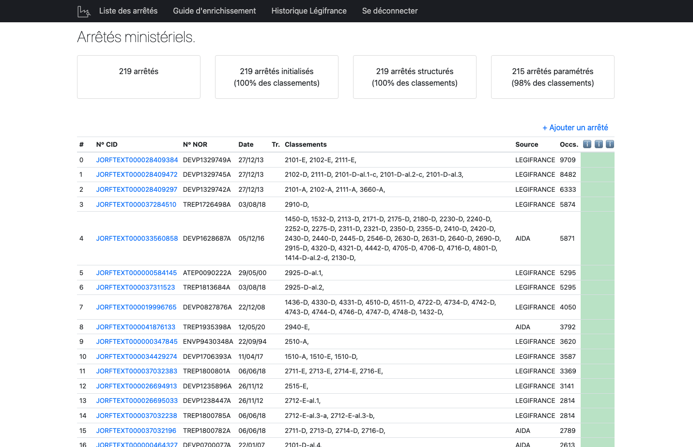

# Envinorma back-office

Back office du projet Envinorma. Permet la gestion de la base de données des arrêtés ministériels.



# Exécuter en local

```sh
git clone git@github.com:Envinorma/back-office.git
cd back-office
cp config_template.ini config.ini  # Fill config.ini
pip install -r requirements.txt  # In a virtual environment
make start
# Visit http://127.0.0.1:8050/
```

**NB**
Cette application nécessite l'accès à une base de donnée postgresql.
Elle peut être initialisée à partir des fichiers contenus dans le dossier `backups`.

```sh
pg_restore -d DATABASE_NAME 2021-06-14-09-32.dump
```
